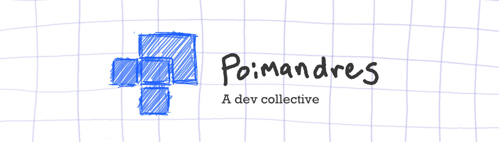

# Org

Poimandres is an open source developer collective for creative technology and developer tooling. We make things for people who make things. Our projects are sustained through shared effort, mutual support, and trust.

Read the collective's draft [Charter](./CHARTER.md) to learn about our principles, decision making and more.

Read the collective's [initiatives](./initiatives/) to learn about our current projects